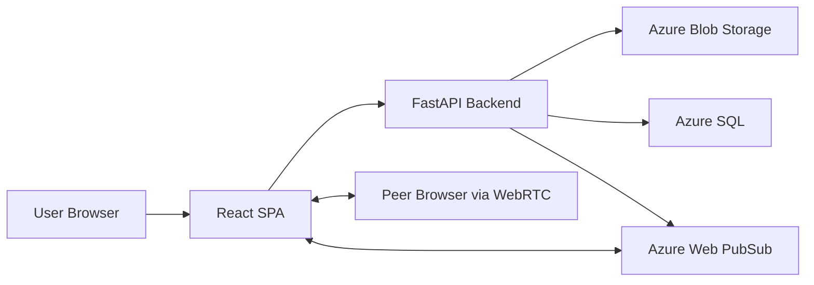
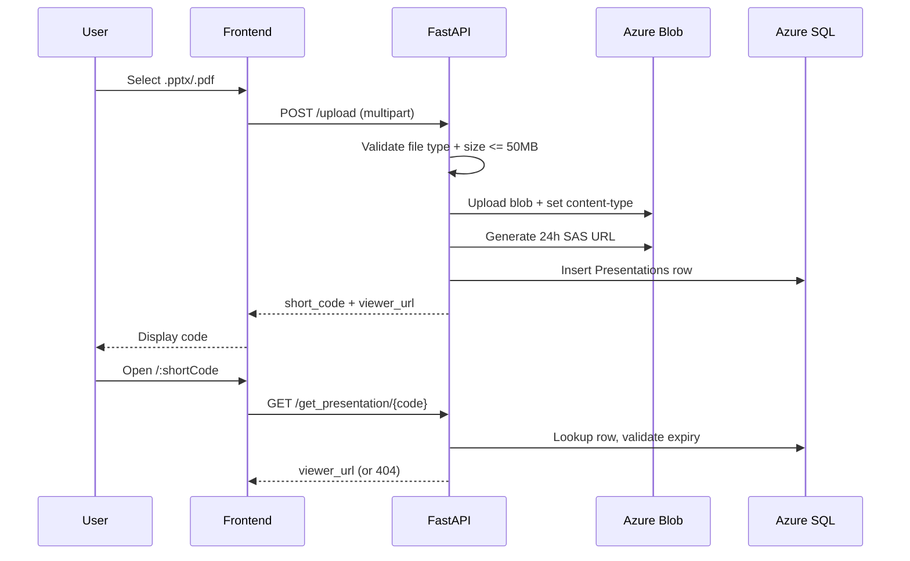

# linkmydesk

Instant, anonymous presentation and screen-sharing links for any device.

linkmydesk is a full-stack sharing platform where users can upload `.pptx`/`.pdf` files or start a live screen stream, get a short code, and open content from another device without accounts or setup friction.


## 1) Overview

linkmydesk solves a common real-world problem: moving a presentation or live screen stream from one device to another quickly.

It is designed for:
- presenters switching between laptop and meeting-room display
- users who need temporary, no-account sharing
- quick collaboration where links/codes should expire automatically

Major capabilities:
- upload-based temporary file sharing
- short-code retrieval flow
- live browser screen sharing via WebRTC signaling
- 24-hour expiry model for shared artifacts

## 2) Features

### Core platform
- Anonymous access (no user accounts)
- Short code generation (`XXX-XXX` format)
- 24-hour expiry semantics
- Viewer-first UX (`/:shortCode`)

### Backend features
- FastAPI REST endpoints for upload/retrieval
- Azure Blob upload with content-type handling
- SAS-tokenized blob URLs (24h read window)
- Azure SQL persistence with retry logic for serverless wake-up
- Web PubSub token issuance for screen-share signaling

### Frontend features
- React + Vite SPA with route-based flows
- Drag-and-drop uploader (`react-dropzone`)
- Upload progress UI and status overlays
- Code copy/link copy interactions
- Presentation viewer (PDF embed + Office viewer iframe)
- Live screen viewer client with connection states

### Infrastructure & integrations
- Azure Blob Storage
- Azure SQL Database
- Azure Web PubSub
- GitHub Actions workflow for backend zip deployment
- Azure CLI setup scripts for bootstrap/provisioning

### Developer experience
- `.env.example` templates for frontend/backend
- helper scripts for table creation, connectivity checks, blob metadata fixes
- local dev defaults for CORS and API base URLs

## 3) Architecture

High-level system design:
- **Frontend SPA** handles UX, upload, code entry, and WebRTC endpoints
- **FastAPI backend** validates requests, stores metadata, and issues signaling tokens
- **Azure services** store content and provide data/signaling infrastructure



### Upload and retrieval flow



### Live screen-share signaling flow

```mermaid
sequenceDiagram
  participant Sharer
  participant API
  participant WPS as Azure Web PubSub
  participant Viewer

  Sharer->>API: POST /room/screen/create
  API->>WPS: issue access token (group-scoped)
  API-->>Sharer: code + wsUrl
  Sharer->>WPS: connect websocket

  Viewer->>API: POST /room/screen/join {code}
  API-->>Viewer: wsUrl (if marker exists & not expired)
  Viewer->>WPS: connect websocket
  Viewer->>Sharer: viewer-joined (group msg)
  Sharer->>Viewer: WebRTC offer/ICE via WPS
  Viewer->>Sharer: answer/ICE via WPS
  Sharer<->>Viewer: Media via WebRTC
```

## 4) Tech Stack

| Category | Technologies |
|---|---|
| Frontend | React 19, Vite 6, React Router DOM 7, Tailwind CSS, Axios, react-dropzone, react-hot-toast |
| Backend | Python 3.10+, FastAPI, Uvicorn, Pydantic v2 |
| Database | Azure SQL Database, SQLAlchemy 2.x |
| Realtime | Azure Web PubSub, WebSocket signaling, WebRTC |
| Storage | Azure Blob Storage (`azure-storage-blob`) |
| Infra / Cloud | Azure App Service, Azure Resource Group setup scripts |
| DevOps | GitHub Actions (`deploy-backend.yml`), Azure CLI zip deploy |
| Authentication | No end-user auth; service-level credentials via env vars |
| APIs / Integrations | Office Online viewer URL, Browser MediaDevices APIs |
| AI / ML | Not used in current implementation |

## 5) Core Workflows

### A. File upload pipeline
1. Frontend validates extension/size via dropzone config.
2. Backend re-validates MIME type and file size.
3. File uploads to Blob Storage with proper content type.
4. Backend generates SAS URL and viewer URL.
5. Metadata saved in `Presentations` table with `ExpiresAt`.
6. Short code returned to user.

### B. Retrieval pipeline
1. Viewer page requests `/get_presentation/{short_code}`.
2. Backend fetches row from SQL.
3. If expired: blob + DB cleanup attempted, then `404`.
4. If valid: returns viewer URL.
5. Frontend renders PDF `<embed>` or Office `<iframe>`.

### C. Screen sharing pipeline
1. Sharer creates room via `/room/screen/create`.
2. Backend writes marker blob (`screen_{code}` metadata includes expiry).
3. Sharer and viewer join group-scoped Web PubSub sockets.
4. Offer/answer/ICE exchanged over group messages.
5. Media streams peer-to-peer via WebRTC.

### D. Background/ops workflow
- CI workflow deploys backend on pushes affecting `backend/**`.
- Expired presentations are also expected to be cleaned by an external scheduled cleanup process (documented in [`backend/README.md`](./backend/README.md)).

## 6) Project Structure

```text
linkmydesk/
├─ frontend/
│  ├─ src/
│  │  ├─ App.jsx               # Main UI, uploader, viewer routing
│  │  ├─ SharerPanel.jsx       # Live screen-share controls
│  │  ├─ ScreenViewer.jsx      # Screen viewer connection UI
│  │  └─ useScreenShare.js     # WebRTC + WebSocket sharer logic
│  ├─ package.json
│  └─ .env.example
├─ backend/
│  ├─ main.py                  # FastAPI app + API routes + Azure integrations
│  ├─ create_table.py          # SQL bootstrap script
│  ├─ test_connection.py       # Connectivity diagnostic script
│  ├─ fix_blob_content_types.py
│  ├─ setup-azure.sh           # Resource provisioning helper
│  ├─ register-providers.sh
│  └─ .env.example
├─ .github/workflows/
│  └─ deploy-backend.yml       # Build and deploy backend to Azure App Service
└─ README.md
```

## 7) API Documentation

No authentication is required for current endpoints.

### Health
- `GET /`

Response:
```json
{
  "message": "LinkMyDesk API is running.",
  "version": "1.0.0",
  "environment": "development",
  "timestamp": "2026-05-17T15:00:00.000000"
}
```

### Presentation APIs
- `POST /upload`  
  `multipart/form-data` with `file`
- `GET /get_presentation/{short_code}`

Upload response:
```json
{
  "short_code": "A7B-K9X",
  "original_file_name": "deck.pptx",
  "viewer_url": "https://view.officeapps.live.com/op/view.aspx?src=..."
}
```

Lookup response:
```json
{
  "viewer_url": "https://.../blob-or-office-viewer-url"
}
```

### Screen share APIs
- `POST /room/screen/create`
- `POST /room/screen/join` with JSON body:

```json
{
  "code": "A7B-K9X"
}
```

Returns Web PubSub socket URL:
```json
{
  "wsUrl": "wss://<service>.webpubsub.azure.com/client/hubs/..."
}
```

### Debug endpoint
- `GET /debug/presentations` (development/debug use)

## 8) AI / ML

This repository currently has **no AI/ML pipeline**: no model serving, embeddings, vector DB, RAG, or agent orchestration.

## 9) Security Considerations

Implemented:
- strict file type/size validation on backend
- CORS allowlist configuration through env vars
- security headers middleware (`nosniff`, `X-Frame-Options`, CSP, XSS protection)
- production-mode generic error responses
- SAS-scoped blob access URLs (time-limited read access)

Current gaps to address for production hardening:
- no user authentication/authorization model
- no request rate limiting/abuse controls
- debug endpoint should be gated or removed in production
- setup scripts include hardcoded sample credentials and should be sanitized

## 10) Installation & Setup

### Prerequisites
- Node.js 18+
- Python 3.10+
- Azure resources (Blob + SQL + optional Web PubSub)

### Clone
```bash
git clone https://github.com/alwayselse/linkmydesk.git
cd linkmydesk
```

### Backend setup
```bash
cd backend
python3 -m venv venv
source venv/bin/activate
pip install -r requirements.txt
cp .env.example .env
```

Set required backend env vars in `.env`, then:
```bash
python create_table.py   # one-time DB schema bootstrap
uvicorn main:app --reload --host 127.0.0.1 --port 8000
```

### Frontend setup
```bash
cd frontend
npm install
cp .env.example .env
npm run dev
```

### Docker
No Dockerfiles or docker-compose configuration are currently committed.

## 11) Environment Variables

### Backend (`backend/.env`)

| Variable | Required | Description |
|---|---:|---|
| `AZURE_STORAGE_CONNECTION_STRING` | Yes | Azure Blob Storage connection string |
| `AZURE_SQL_CONNECTION_STRING` | Yes | SQLAlchemy connection string for Azure SQL |
| `CONTAINER_NAME` | No | Blob container name (default: `presentations`) |
| `ENVIRONMENT` | No | `development` or `production` |
| `CORS_ALLOWED_ORIGINS` | No | Comma-separated frontend origins |
| `AZURE_WEBPUBSUB_CONNECTION_STRING` | For screen share | Enables screen-sharing signaling |
| `AZURE_WEBPUBSUB_HUB` | No | PubSub hub name (default: `screenshare`) |

### Frontend (`frontend/.env`)

| Variable | Required | Description |
|---|---:|---|
| `VITE_API_BASE_URL` | Yes | Base URL for backend API |

## 12) Deployment

### Current deployment architecture
- Backend: Azure App Service (zip deploy via Azure CLI in GitHub Actions)
- Storage/Data: Azure Blob + Azure SQL
- Realtime signaling: Azure Web PubSub (optional but required for screen share)

### CI/CD
`.github/workflows/deploy-backend.yml`:
- triggers on push to `main` when backend/workflow files change
- installs Python dependencies
- zips backend directory
- deploys with `az webapp deployment source config-zip`

### Reverse proxy / scaling
- App Service handles HTTP serving; no custom reverse proxy config is committed.
- Horizontal scaling strategy is not defined in repo yet.

## 13) Performance & Scalability

Current optimizations:
- DB `pool_pre_ping` + `pool_recycle` + connection timeout tuning
- retry wrapper for serverless SQL wake-up timeouts
- blob upload with `max_concurrency=4`
- direct PDF rendering and Office-hosted viewer offload
- WebRTC peer-to-peer media path reduces backend media load

Scalability considerations:
- code-space collision risk rises with volume (currently random with retry)
- no distributed rate limiter
- SQL and Blob access are synchronous from app perspective (no queue pipeline)

## 14) Known Limitations

- No formal auth/roles for upload/view actions
- No built-in rate limiting or anti-abuse controls
- Debug endpoint is present in API
- Cleanup scheduling is described but scheduler code is not in this repository
- No automated frontend deployment workflow in `.github/workflows`
- No committed test suite for frontend/backend
- No top-level LICENSE file currently present

## 15) Future Improvements

- Add authentication options for protected rooms
- Add Redis-backed rate limiting and abuse detection
- Add explicit TTL cleanup worker/service in-repo
- Add backend and frontend automated tests in CI
- Add TURN server config for improved WebRTC reliability behind strict NATs
- Add Docker + compose for reproducible local/prod environments
- Add observability stack (structured metrics, tracing, alerts)

## 16) Contributing

1. Fork the repository
2. Create a feature branch (`feature/your-change`)
3. Keep changes focused and documented
4. Validate local build/run flows
5. Open a PR with a clear summary and rationale

Suggested local checks:
```bash
# frontend
cd frontend && npm run build

# backend (basic)
cd backend && uvicorn main:app --reload
```

## 17) License

No root `LICENSE` file is currently committed.  
Add a `LICENSE` file to explicitly define distribution terms.

## 18) Author / Credits

- **Author:** [@alwayselse](https://github.com/alwayselse)
- Frontend credits/contact references are embedded in UI footer (`frontend/src/App.jsx`).
