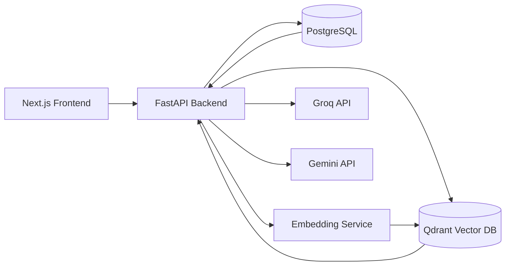

# Datalingo

**Adaptive AI tutoring platform for Data Science & Business Analytics education.**


Datalingo is a production-oriented AI learning system that personalizes tutoring for university students through retrieval-augmented LLM chat, Bayesian knowledge modeling, and long-term memory-aware learning pipelines.

## 1) Hero Section

### Why Datalingo
Datalingo combines modern LLM infrastructure with pedagogical intelligence to deliver adaptive tutoring, measurable skill progression, and explainable analytics for both learners and instructors.

## 2) Features

- **Adaptive AI Tutoring**: Context-aware tutor responses based on student proficiency and course scope.
- **Personalized Learning Paths**: Dynamically adjusts content difficulty and sequencing.
- **Bayesian Knowledge Tracing (BKT)**: Probabilistic mastery tracking at concept level.
- **RAG Pipeline**: Retrieves trusted course context before generation.
- **Long-Term Memory System**: Persists relevant learner history across sessions.
- **Teacher Analytics Dashboard**: Surfaces cohort trends, weak concepts, and intervention signals.
- **Business Analytics Multi-Agent Pipeline**: Agent collaboration for analytics reasoning, decomposition, and reporting.
- **SSE Streaming Chat**: Real-time token streaming for low-latency conversational UX.
- **Document Upload + Semantic Retrieval**: Ingests study resources and indexes embeddings for targeted retrieval.
- **MCQ Prerequisite Assessment**: Quick concept readiness evaluation before advanced modules.
- **Knowledge Tracking**: Continuous progression snapshots over topics and subskills.
- **AI-Generated Summaries**: Session-level and topic-level concise summaries.
- **Memory Palace System**: Structured conceptual anchors to reinforce retention.

## 3) System Architecture



## 4) Tech Stack

| Layer | Technologies |
|---|---|
| **Frontend** | Next.js 15, React, TypeScript, Tailwind CSS, Zustand |
| **Backend** | FastAPI, PostgreSQL, Qdrant, Groq API, Gemini API, PM2, Uvicorn |
| **AI / ML** | RAG, Bayesian Knowledge Tracing, Embeddings, Multi-agent orchestration, Semantic search |

## 5) Core AI Concepts

- **Bayesian Knowledge Tracing (BKT)**: Models each concept as a latent mastery state and updates belief after each learner interaction.
- **Retrieval-Augmented Generation (RAG)**: Grounds LLM outputs with semantically retrieved course and knowledge-base context.
- **Memory Palace**: Organizes durable conceptual memory as linked semantic anchors for stronger recall.
- **Dream Queue**: Deferred background reflection queue that converts interactions into durable learning artifacts.
- **Multi-Agent Orchestration**: Specialized agents coordinate planning, reasoning, critique, and synthesis for complex tasks.
- **Semantic Retrieval**: Vector search over embedded content to fetch high-signal evidence for tutoring and analytics.

## 6) Key Workflows

### Student Chat Flow
1. Student prompt arrives via SSE endpoint.
2. Backend resolves learner profile + current mastery state.
3. RAG fetches relevant context from Qdrant.
4. LLM generates grounded response and streams tokens.
5. BKT + memory modules update post-interaction state.

### Business Analytics Pipeline
1. Query is decomposed into subtasks.
2. Multi-agent pipeline executes analysis and validation.
3. Evidence is synthesized into final insight/report output.

### Document Upload Pipeline
1. User uploads PDFs/slides/notes.
2. Files are chunked, embedded, and indexed in Qdrant.
3. Metadata is stored in PostgreSQL for traceable retrieval.

### Memory Extraction Pipeline
1. Conversation traces are scored for salience.
2. High-value learning signals are transformed into long-term memory entries.
3. Future tutor responses inject relevant memory context.

## 7) Project Structure

```text
datalingo/
├── frontend/
│   ├── app/
│   ├── components/
│   ├── hooks/
│   ├── stores/
│   └── lib/
├── backend/
│   ├── app/
│   │   ├── api/
│   │   ├── core/
│   │   ├── services/
│   │   ├── ai/
│   │   ├── models/
│   │   └── db/
│   ├── scripts/
│   └── tests/
├── docker/
├── docs/
└── README.md
```

## 8) API Overview

| Group | Routes (examples) |
|---|---|
| **Auth** | `POST /api/auth/login`, `POST /api/auth/register`, `POST /api/auth/refresh` |
| **Chat** | `POST /api/chat/message`, `GET /api/chat/stream`, `GET /api/chat/history/{student_id}` |
| **Analytics** | `GET /api/analytics/student/{id}`, `GET /api/analytics/cohort`, `GET /api/analytics/concepts` |
| **Admin** | `GET /api/admin/users`, `POST /api/admin/courses`, `PATCH /api/admin/settings` |
| **BA Tools** | `POST /api/ba/run`, `POST /api/ba/agents/plan`, `GET /api/ba/reports/{report_id}` |

## 9) Screenshots

> Replace placeholders with actual product screenshots.

- `docs/screenshots/dashboard-overview.png`
- `docs/screenshots/student-chat.png`
- `docs/screenshots/knowledge-tracking.png`
- `docs/screenshots/teacher-analytics.png`
- `docs/screenshots/ba-agent-pipeline.png`

## 10) Installation

### Clone
```bash
git clone https://github.com/<your-org>/datalingo.git
cd datalingo
```

### Backend Setup
```bash
cd backend
python3 -m venv .venv
source .venv/bin/activate
pip install -r requirements.txt
cp .env.example .env
uvicorn app.main:app --reload --host 0.0.0.0 --port 8000
```

### Frontend Setup
```bash
cd frontend
npm install
cp .env.local.example .env.local
npm run dev
```

### Run Services
- Frontend: `http://localhost:3000`
- Backend: `http://localhost:8000`

## 11) Environment Variables

| Variable | Layer | Required | Description |
|---|---|---|---|
| `DATABASE_URL` | Backend | Yes | PostgreSQL connection URI |
| `QDRANT_URL` | Backend | Yes | Qdrant endpoint |
| `QDRANT_API_KEY` | Backend | Optional | API key for managed Qdrant |
| `GROQ_API_KEY` | Backend | Yes* | Groq model access key |
| `GEMINI_API_KEY` | Backend | Yes* | Gemini model access key |
| `EMBEDDING_MODEL` | Backend | Yes | Embedding model identifier |
| `JWT_SECRET` | Backend | Yes | JWT signing secret |
| `NEXT_PUBLIC_API_BASE_URL` | Frontend | Yes | Public backend base URL |
| `NEXT_PUBLIC_SSE_URL` | Frontend | Yes | SSE endpoint base URL |
| `NODE_ENV` | Frontend/Backend | Yes | Runtime environment |

\* At least one model provider key should be configured.

## 12) Deployment (VPS)

1. **Provision stack**: Ubuntu VPS + Nginx reverse proxy + TLS.
2. **PostgreSQL**: Deploy managed/self-hosted PostgreSQL with backups.
3. **Qdrant**: Deploy Qdrant service (Docker/systemd) with persistent volume.
4. **Backend**:
   - Run FastAPI with Uvicorn.
   - Keep process alive with PM2 (`pm2 start "uvicorn app.main:app --host 0.0.0.0 --port 8000"`).
5. **Frontend**:
   - Build Next.js app (`npm run build`).
   - Serve with `next start` behind Nginx.
6. **Observability**:
   - Centralized logs, health checks, and resource alerts.

## 13) Scalability & Future Improvements

- Redis caching for retrieval/session acceleration
- Async DB patterns and pooled connection tuning
- Kubernetes-based service orchestration
- Improved session architecture for high-concurrency tutoring
- Distributed embedding generation pipelines
- Dedicated queue workers for heavy AI/background tasks

## 14) Research / Engineering Highlights

- Adaptive prompting strategies aligned to learner mastery
- Sliding-window conversational memory for coherence
- Long-term memory injection into retrieval/generation context
- Semantic memory retrieval across historical sessions
- Multimodal document ingestion and enrichment
- SSE token streaming for responsive tutoring UX
- AI-driven analytics for student and cohort intelligence

## 15) Contributing

Contributions are welcome.

1. Fork the repository
2. Create a feature branch: `git checkout -b feat/your-feature`
3. Commit changes: `git commit -m "feat: add your feature"`
4. Push your branch
5. Open a Pull Request with clear context and test notes

Please keep PRs focused, documented, and aligned with project architecture.

## 16) License

This project is licensed under the **MIT License**. See `LICENSE` for details.

## 17) Author

Built by [Your Name]
